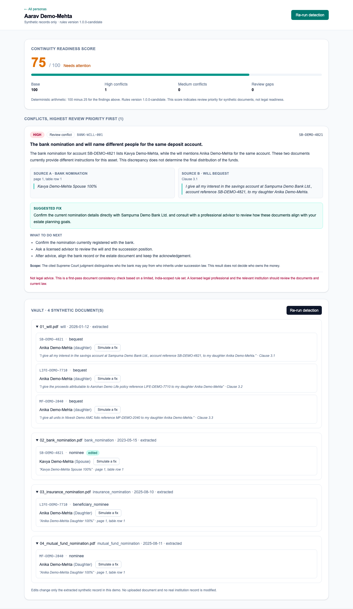

# JeevanSetu — AI estate conflict detector

JeevanSetu reads a person's will, nomination forms, and insurance beneficiary forms, extracts who is named for each asset, and flags real inconsistencies between those documents using a small, sourced, India-scoped rule set. Every finding cites the exact text it came from, explains the limits of what it can conclude, and carries a not-legal-advice disclaimer.

> **Synthetic demo data only. Not legal advice.** Do not upload real personal, financial, identity, or estate documents. Findings are informational and require review by a licensed professional and the relevant institution.

## What the demo shows

The conflict persona has a will giving a bank account to a daughter while the registered bank nomination for that same account names a spouse. The engine reports one high-priority conflict, cites both sources, and scores the persona 75/100. Correcting the nominee in the vault and re-running detection clears the conflict and raises the score to 100, and undo puts it back.

Four seeded personas cover one of each outcome the engine can produce:

| Persona | Outcome | Rule or marker | Score |
|---|---|---|---:|
| Aarav Demo-Mehta | review conflict | `BANK-WILL-001` | 75 |
| Rohan Demo-Sen | nothing found | — | 100 |
| Priya Demo-Iyer | validity warning | `NPS-VALIDITY-001` | 75 |
| Meera Demo-Rao | manual review required | `GAP-JOINT-HOLDING` | 97 |



## Quick start

Prerequisites: Docker Desktop with Docker Compose. A Gemini API key is optional for the demo.

```bash
git clone <this-repo> jeevansetu && cd jeevansetu
cp .env.example .env            # optional: add GEMINI_API_KEY for live extraction
docker compose up --build --detach
docker compose exec backend python scripts/seed_demo.py --yes
open http://localhost:3000
```

- Frontend: http://localhost:3000
- API docs: http://localhost:8000/docs
- Health: http://localhost:8000/health

Stop with `docker compose down`. The SQLite file lives at `backend/data/jeevansetu.db` and is ignored by Git.

### Four-minute demo script

1. Open http://localhost:3000 and pick **Aarav Demo-Mehta**.
2. Read the **score of 75** and the breakdown showing the arithmetic.
3. Read the single **`BANK-WILL-001`** card: source A is the bank nomination naming Kavya, source B is will clause 3.1 naming Anika, with the scope note and disclaimer.
4. Scroll to the **vault**, open `02_bank_nomination.pdf`, press **Simulate a fix**, change the name to `Anika Demo-Mehta`, and save.
5. Press **Re-run detection**. The conflict clears and the score rises to **100**. Press **Undo last fix** and re-run to put it back to 75.
6. Open **Rohan Demo-Sen** to show a clean persona scoring 100 with no findings.

If you have longer, two more personas show the outcomes that are not conflicts:

7. **Priya Demo-Iyer** — a `validity_warning`, not a conflict. Her NPS nomination predates her confirmed marriage date, so the rule questions that document's own standing. `NPS-WILL-001` is deliberately suppressed here rather than stacked on top.
8. **Meera Demo-Rao** — a `scope_gap`. Her bank nomination and will name different people, which would normally be `BANK-WILL-001`, but the account is held jointly and the rule is scoped to individually held accounts. The engine says manual review required instead of guessing. Note the score is *higher* at 97: a gap deducts 3 where a conflict deducts 25.

### Demo reset

```bash
# pre-verified snapshot, no API key needed, labelled in the UI as not live AI
docker compose exec backend python scripts/seed_demo.py --yes

# real Gemini extraction of the eleven synthetic PDFs (needs GEMINI_API_KEY)
docker compose exec backend python scripts/seed_demo.py --yes --mode live
```

## What is real and what is simplified

**Real and working**

- Upload of synthetic PDF, image, and text documents with size, extension, MIME, and content-signature validation.
- Gemini classification and structured field extraction, with every value carrying its exact source text, a locator, and a confidence.
- The deterministic conflict engine: all seven documented rules, in Python, with no AI in any rule decision.
- The readiness score, the results UI, the vault, the simulated fix, and re-running detection.
- Honest failure handling: a provider failure keeps the upload, marks the document failed, and stays retryable.
- A simulated fix is reversible per field. Edits stack, undo unwinds them one at a time, and the log records the previous and new value of each. Re-extraction still refuses to discard edits without `force=true`, and a forced re-extraction clears the document's fields and their edit history together.
- Holding pattern is extracted, so the bank, mutual-fund, and supersession rules stay inside their documented single-holder scope and report `GAP-JOINT-HOLDING` for a joint asset.

**Deliberately simplified for the hackathon**

- No user accounts. A persona is one synthetic individual, and both Compose ports bind to loopback only. An optional shared-token gate exists for hosting and is off by default; see [`docs/DEPLOYMENT.md`](docs/DEPLOYMENT.md).
- SQLite instead of Postgres, with no migration framework. Schema changes reset the synthetic database.
- No institution integration of any kind. Nothing here connects to a real bank, insurer, AMC, or the NPS.
- Fallback seed data is a snapshot of previously verified live extraction, labelled `manual_fallback` in the interface.

**Known limitations, recorded not hidden**

- `render.yaml` describes a complete Render deployment and the wiring has been rehearsed in containers, but no live instance exists yet. On Render's free plan there is no persistent disk, so uploads and edits do not survive a restart and the demo reseeds itself on each cold start.
- The hosted access control is one shared username and password, not user accounts.
- `holding_pattern` of `unknown` is treated as in scope, so a jointly held asset that does not state its holding pattern can still be reported as a conflict (`backend/rules/RULES.md` section 14).
- The Gemini free tier may use submitted content to improve Google's products, which is why only synthetic documents are permitted.
- Gap markers (`GAP-*`) are engine labels for cases the rules exclude. They are not approved legal rules.
- Frontend tests cover the three components that carry the safety-critical labels, not the pages or the proxy route.
- Leaving rule scope raises the score, because a gap deducts 3 where a conflict deducts 25 (`backend/rules/RULES.md` section 14). A gap never means the asset is fine. The joint-holding persona scores 97 for exactly this reason.
- Three of the seven rules are not demonstrated by any seeded persona and are covered only by unit tests: `LIFE-NOTICE-001`, `LIFE-WILL-001`, `MF-WILL-001` and `NPS-WILL-001` (the last is deliberately suppressed where it would otherwise fire).
- The `API_TOKEN` gate is one shared secret, not authentication. The frontend credential covers the proxy, so a hosted instance is not an open relay, but neither gate identifies a caller; see [`docs/DEPLOYMENT.md`](docs/DEPLOYMENT.md).

## The rule set and its sources

Seven rules, all documented in [`backend/rules/RULES.md`](backend/rules/RULES.md) with predicates, severities, exclusions, and examples. Sources were re-verified on 2026-09-29.

| Rule | Source |
|---|---|
| `BANK-WILL-001` | [Supreme Court of India, *Ram Chander Talwar v. Devender Kumar Talwar*](https://api.sci.gov.in/jonew/judis/36985.pdf), applying Banking Regulation Act section 45ZA |
| `LIFE-NOTICE-001` | [Insurance Act, 1938](https://ifsca.gov.in/CommonDirect/PreviewPdf?fileName=Insurance_Act_1938_20260717_0231.pdf&id=29709e474fe6b066fc0cb19f7d6ac244), sections 39(2)–(3) |
| `LIFE-WILL-001` | Insurance Act, 1938, sections 39(6)–(7), with sections 38 and 39(12) as exclusions |
| `MF-WILL-001` | [SEBI circular dated 28 February 2025](https://www.sebi.gov.in/sebi_data/attachdocs/feb-2025/1740743883077.pdf) and its Annexure A nomination form; [SEBI investor guidance](https://investor.sebi.gov.in/market-nomination.html) |
| `NPS-WILL-001` | [PFRDA (Exits and Withdrawals under the NPS) Regulations, 2015](https://pfrda.org.in/documents/33652/184762/PFRDA+Exits+and+Withdrawals+under+the+NPS+Regulations+2015+_Last+amended+on+20+July+2026_+(1).pdf), Chapter VII |
| `NPS-VALIDITY-001` | Same PFRDA regulation, nomination provisos (iv)–(vi) |
| `RECORD-SUPERSESSION-001` | The registration and supersession provisions across the four sources above |

The rules are scoped to "as commonly understood for these asset types in India" and are not exhaustive or authoritative. No rule decides who legally owns an asset, who inherits, or which document prevails. SEBI published a March 2026 consultation paper proposing modified nomination norms; because it is still a draft, no rule is sourced from it.

## How it works

```text
Browser (Next.js :3000)
  └── FastAPI (:8000)
        ├── uploads.py      validation + generated storage keys
        ├── extraction.py   Gemini classification + structured extraction
        ├── detection.py    deterministic rules  ← no AI, ever
        ├── scoring.py      readiness score + completeness gaps
        ├── explanations.py Gemini wording for already-decided findings
        └── SQLite (backend/data/jeevansetu.db)
```

The boundary that matters: `detection.py` imports no model client. A test asserts its source contains no AI reference and that constructing a client during detection fails. Gemini is used only to extract fields and to reword a finding the engine has already decided, and model wording is rejected outright if it states a legal outcome.

## Configuration

Copy `.env.example` to `.env`. Never commit a real key.

| Variable | Default | Purpose |
|---|---|---|
| `GEMINI_API_KEY` | empty | Gemini Developer API key, backend only, never sent to the browser |
| `GEMINI_MODEL` | `gemini-3.1-flash-lite` | Multimodal extraction and wording model |
| `DATABASE_PATH` | `/app/data/jeevansetu.db` | SQLite path inside the container |
| `UPLOAD_DIR` | `/app/data/uploads` | Generated storage for synthetic uploads |
| `MAX_UPLOAD_BYTES` | `10485760` | Per-document upload limit |
| `CORS_ORIGINS` | `http://localhost:3000` | Browser origin allowlist |
| `NEXT_PUBLIC_API_URL` | `http://localhost:8000` | API URL compiled into the browser bundle |
| `API_TOKEN` | empty | Shared bearer token for the API. Empty leaves it open, which is correct on loopback only |
| `BACKEND_URL` | `http://backend:8000` | Backend address used by the frontend proxy route. A bare hostname is treated as `https://` |
| `BASIC_AUTH_USER`, `BASIC_AUTH_PASSWORD` | empty | Shared credential for a hosted frontend, checked on every request including the proxy |
| `PUBLIC_DEPLOYMENT` | empty | `true` makes the frontend refuse traffic if the credential above is missing |
| `SEED_ON_STARTUP` | empty | `true` seeds the demo when the database comes up empty, for hosts with no persistent disk |

[`render.yaml`](render.yaml) is a working Render Blueprint for this stack, and [`docs/DEPLOYMENT.md`](docs/DEPLOYMENT.md) is the runbook: what each setting is for, what was verified, and what has not been.

## API

| Endpoint | Purpose |
|---|---|
| `GET /health` | API and SQLite readiness |
| `GET /personas` | List demo personas |
| `POST /personas` | Create a persona; requires explicit synthetic attestation |
| `POST /personas/{id}/documents` | Upload and extract a synthetic document |
| `GET /documents/{id}` | Extraction status and source-backed fields |
| `POST /documents/{id}/extract` | Retry extraction; refuses to discard simulated fixes without `force=true` |
| `PATCH /fields/{id}` | Apply a simulated synthetic correction |
| `POST /fields/{id}/undo` | Revert the most recent simulated fix; `409` when there is nothing to undo |
| `POST /personas/{id}/detections` | Run detection and score; `?explain=false` skips model wording |
| `GET /personas/{id}/detections/latest` | Most recent run |

## Development

```bash
cd backend
python3 -m venv .venv
.venv/bin/python -m pip install --requirement requirements.txt
.venv/bin/python -m pytest              # 131 tests
.venv/bin/uvicorn app.main:app --reload
```

```bash
cd frontend
npm ci
npm test                                # 31 tests, Vitest + Testing Library
npm run lint && npm run build
npm run dev
```

Verification scripts, which need a running keyed backend:

```bash
cd backend
.venv/bin/python scripts/verify_phase2_live.py   # five extraction-only fixtures
.venv/bin/python scripts/verify_phase3_live.py   # seven demo PDFs vs the manifest
```

The fallback snapshot must stay a record of real extraction output rather than hand-written values. Regenerate it only from a live seed:

```bash
cd backend
.venv/bin/python scripts/seed_demo.py --yes --mode live
.venv/bin/python scripts/export_demo_fallback.py   # refuses anything not extraction_source=gemini
```

## Repository layout

```text
backend/app/       FastAPI app, rules engine, scoring, extraction, schema
backend/rules/     RULES.md — the authoritative rule set and its sources
backend/scripts/   demo seed and live verification scripts
backend/tests/     131 backend tests
frontend/          Next.js results UI, vault, and the deployment proxy route
seed_data/         synthetic demo documents, sources, and expected outcomes
docs/              PRD, pitch talking points, and the deployment runbook
reports/           per-phase completion reports
```

Project history lives in [`PROGRESS.md`](PROGRESS.md) and [`DECISIONS.md`](DECISIONS.md), which records every architectural decision, deviation, and legal source with its reasoning.

## Stretch concept: estate case view

`GET /personas/{id}/estate-case` and the page at `/personas/{id}/estate-case` show an illustrative per-institution settlement checklist derived from the synthetic vault.

This is a **concept / future feature**, labelled as such in the API payload, a persistent page banner, every asset card, and the footer. No bank, insurer, asset management company, or the NPS is connected. The steps are generic illustrations, not any institution's real requirements, and are not sourced legal or procedural rules — which is why they appear nowhere in `RULES.md` and have no rule IDs. The generator touches neither the conflict engine nor the score.
